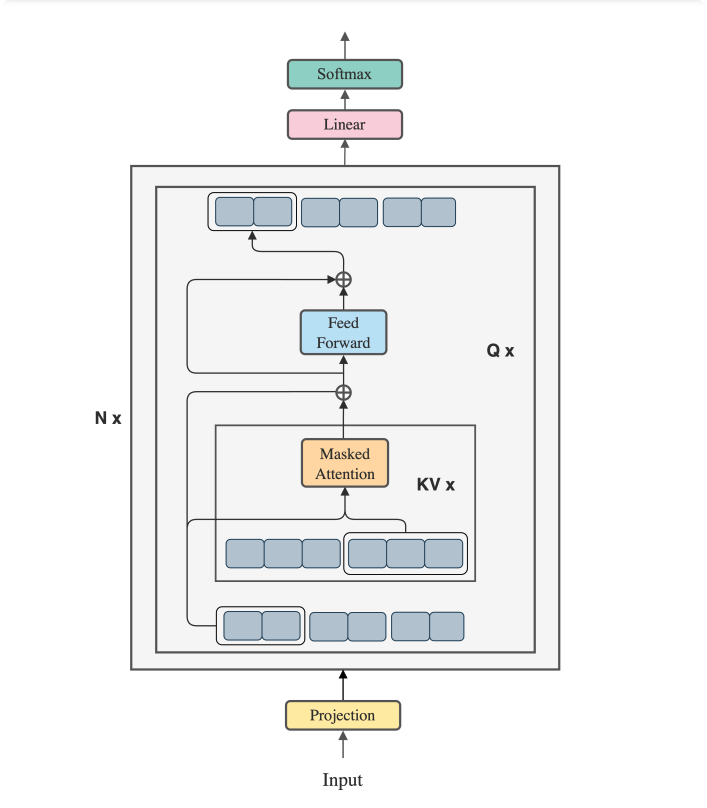

# Blockwise-Parallel-Transformer-for-Long-Context-Large-Models
32 times longer context window than vanilla Transformers and up to 4 times longer than memory efficient Transformers.

[Blockwise Parallel Transformer for Long Context Large Models](https://arxiv.org/pdf/2305.19370.pdf)



This repository contains a PyTorch implementation of the Blockwise Parallel Transformer Attention module, which is a variant of the Transformer Attention mechanism that is designed to handle long sequences more efficiently.

The Blockwise Parallel Transformer Attention module splits the input sequence into blocks and computes the attention output for each block in parallel. This allows the module to handle long sequences more efficiently than the standard Transformer Attention mechanism, which computes the attention output for each position in the sequence sequentially.


# Agora
This implementation of BlockWise Parallel Transformer is brought to you by Agora, we're devoted to advancing Humanity with open source Multi-Modality AI Research!

[Join our discord and contribute to any of our 30+ active projects!!](https://discord.gg/qUtxnK2NMf)


# Usage
To use the Blockwise Parallel Transformer Attention module in your PyTorch project, follow these steps:

Method 1
## Clone the repository:

`git clone https://github.com/kyegomez/Blockwise-Parallel-Transformer.git`

Then Import the BlockwiseParallelTransformerAttention module in your PyTorch code:

```python from blockwise_parallel_transformer_attention import BlockwiseParallelTransformerAttention```

Create an instance of the BlockwiseParallelTransformerAttention module with the necessary parameters:

```python
input_size = 512
num_heads = 8
hidden_size = 2048
num_layers = 6
max_seq_len = 1024
block_size = 64

model = BlockwiseParallelTransformerAttention(input_size, num_heads, hidden_size, num_layers, max_seq_len, block_size)
```

Pass your input sequence to the BlockwiseParallelTransformerAttention module to get the output:

```python
x = torch.randn(batch_size, seq_len, input_size)
output = model(x)
```

## Example
Here's an example of how to use the BlockwiseParallelTransformerAttention module in a PyTorch project:

```python
import torch
from blockwise_parallel_transformer_attention import BlockwiseParallelTransformerAttention

# Define the input sequence
batch_size = 2
seq_len = 1024
input_size = 512
x = torch.randn(batch_size, seq_len, input_size)

# Define the parameters for the BlockwiseParallelTransformerAttention module
num_heads = 8
hidden_size = 2048
num_layers = 6
max_seq_len = 1024
block_size = 64

# Create an instance of the BlockwiseParallelTransformerAttention module
model = BlockwiseParallelTransformerAttention(input_size, num_heads, hidden_size, num_layers, max_seq_len, block_size)

# Pass the input sequence to the module to get the output
output = model(x)

# Print the shape of the output
print(output.shape)
```

# Contributing
Contributions to this repository are welcome. If you find a bug or have a feature request, please open an issue. If you would like to contribute code, please fork the repository and submit a pull request.


# Parallel Blockwise Class


# Share with Friends!
[Twitter](https://twitter.com/intent/tweet?url=https%3A%2F%2Fgithub.com%2Fkyegomez%2FBlockwise-Parallel-Transformer&text=Check%20out%20this%20PyTorch%20implementation%20of%20the%20Blockwise%20Parallel%20Transformer%20Attention%20module%20for%20efficiently%20handling%20long%20sequences%20in%20deep%20learning%20models%21%20%23deeplearning%20%23pytorch%20%23machinelearning%20%23github&hashtags=deeplearning%2Cpytorch%2Cmachinelearning%2Cgithub)

[Linkedin](https://www.linkedin.com/sharing/share-offsite/?url=https%3A%2F%2Fgithub.com%2Fkyegomez%2FBlockwise-Parallel-Transformer)

[Facebook](https://www.facebook.com/sharer/sharer.php?u=https%3A%2F%2Fgithub.com%2Fkyegomez%2FBlockwise-Parallel-Transformer)

[Whatsapp](https://api.whatsapp.com/send?text=Check%20out%20this%20PyTorch%20implementation%20of%20the%20Blockwise%20Parallel%20Transformer%20Attention%20module%20for%20efficiently%20handling%20long%20sequences%20in%20deep%20learning%20models%21%20https%3A%2F%2Fgithub.com%2Fkyegomez%2FBlockwise-Parallel-Transformer)


# Roadmap
- Pytorch Implementation

- Jax Implementation

- Triton Implementation
